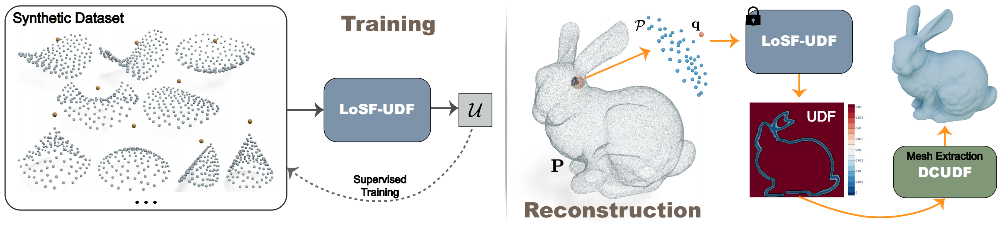

<p align="center">

 <h1 align="center">LoSF: A Lightweight UDF Learning Framework for 3D Reconstruction Based on Local Shape Functions</h1>
  <p align="center">

<p align="center">
  
</p>

**LoSF: A Lightweight UDF Learning Framework for 3D Reconstruction Based on Local Shape Functions**
<p class="title is-5 mt-2">
        <a href="https://faculty.dlut.edu.cn/hujiangbei1/en/index.htm" target="_blank">Jinagbei Hu</a>,
        <a href="" target="_blank">Yanggeng Li</a>,
        <a href="https://lcs.ios.ac.cn/~houf/" target="_blank">Fei Hou</a>,
        <a href="https://sites.google.com/site/junhuihoushomepage/" target="_blank">Junhui Hou</a>,
        <a href="" target="_blank">Zhebin Zhang</a>,
        <a href="" target="_blank">Shengfa Wang</a>,
        <a href="" target="_blank">Na Lei</a>,
        <a href="https://personal.ntu.edu.sg/yhe/" target="_blank">Ying He</a><sup>&#9993</sup>
</p>
  <!-- other links -->
      <div class="is-flex is-justify-content-center">
        <span class="icon-text mx-1">
          <a class="button is-dark" href="https://arxiv.org/abs/2407.01330" role="button" target="_blank"> <span
              class="icon"> </span> <span> Paper </span> </a>
        </span>
        <span class="icon-text mx-1">
          <a class="button is-dark" href="https://jbhu67.github.io/LoSF-UDF.github.io/" role="button" target="_blank">
            <span class="icon"> </ion-icon> </span> <span> Project page </span> </a>
        </span>
        </div>

Abstract:  Unsigned distance fields (UDFs) provide a versatile framework for representing a diverse array of 3D shapes, encompassing both watertight and non-watertight geometries. Traditional UDF learning methods typically require extensive training on large 3D shape datasets, which is costly and necessitates re-training for new datasets. This paper presents a novel neural framework, <b>LoSF-UDF</b>, for reconstructing surfaces from 3D point clouds by leveraging local shape functions to learn UDFs. We observe that 3D shapes manifest simple patterns in localized regions, prompting us to develop a training dataset of point cloud patches characterized by mathematical functions that represent a continuum from smooth surfaces to sharp edges and corners. Our approach learns features within a specific radius around each query point and utilizes an attention mechanism to focus on the crucial features for UDF estimation. Despite being highly lightweight, with only 653 KB of trainable parameters and a modest-sized training dataset with 0.5 GB storage, our method enables efficient and robust surface reconstruction from point clouds without requiring for shape-specific training. Furthermore, our method exhibits enhanced resilience to noise and outliers in point clouds compared to existing methods. We conduct comprehensive experiments and comparisons across various datasets, including synthetic and real-scanned point clouds, to validate our method's efficacy. Notably, our lightweight framework offers rapid and reliable initialization for other unsupervised iterative approaches, improving both the efficiency and accuracy of their reconstructions.

## News
- 2025-01-18: Code released!

## Environment Setup
Our code is implemented in Python 3.9, PyTorch 2.3.0 and CUDA 12.1. We wrote the code based on the  <a href="https://github.com/ashleve/lightning-hydra-template">Lightning-Hydra-Template</a>.
### Conda environment

```shell
conda create -n losf python=3.9
conda activate losf
conda install pytorch==2.3.0 torchvision==0.18.0 torchaudio==2.3.0 pytorch-cuda=12.1 -c pytorch -c nvidia
pip install --extra-index-url https://miropsota.github.io/torch_packages_builder pytorch3d==0.7.7+pt2.3.0cu121
conda install lightning -c conda-forge
pip install hydra-core hydra-colorlog hydra-optuna-sweeper rootutils rich pre-commit
pip install numba trimesh torch_geometric scikit-image matplotlib joblib
pip install torch-cluster -f https://data.pyg.org/whl/torch-2.3.0+cu121.html
```

## Data Preparation
The training data can be downloaded from [Zenodo](https://doi.org/10.5281/zenodo.14678305) . You can also create your own data through `./data/prepare_dataset_smooth.py` and `./data/prepare_dataset_sharp.py`.

## Train
The training process of LoSF is not restricted to any specific shape class. After downloading or generating the training dataset, please place it in `./data/train/`. Following the <a href="https://github.com/ashleve/lightning-hydra-template">Lightning-Hydra-Template</a>, we use Hydra to manage parameter configurations, which are stored in `./configs`. The default configurations are specified in `./configs/train.yaml`. You can start training by running:
```bash
python ./src/train.py
```
You can override the default configurations by creating a new YAML file in the `./configs/experiment`. For example, to test a lighter network, you can reduce the network dimensions as shown in `./configs/experiment/train-lighter.yaml`. The new experiment can be conducted by running:
```bash
python ./src/train.py experiment=train-lighter
```
> <span style="color: red;">⚠</span>  First, update the data directory and work directory in `./configs/paths/default.yaml` and `./configs/data/default.yaml` to match your device configuration.

## Evaluation
- Save the point clouds to be tested in PLY format in a folder `/path/to/pcd/`
- The main execution file is `./src/eval.py`. The parameter passing section is as follows. You can modify the `./configs/experiment/eval.yaml` file to change the parameters.

- You can also specify the parameters via the command line, which will override the YAML configuration
  ```bash
  python ./src/eval.py \
    ckpt_path=/path/to/ckpt \
    data.data_dir=/path/to/pcd \
    mesh.threshold=0.005 \
    mesh.is_cut=false \
    experiment.name=data_full_bdry \
    data.radius=0.04 \
    data.has_noise=false \
    data.noise_level=0.0 \
    paths.output_dir=/dir/to/save/ \
    trainer.devices=[6]
  ```
We provide our trained parameters in `./pretrained/train-total-uniform.ckpt`.

## To Do
- [ ] Add codes that integrate LoSF with unsupervised methods.
- [ ] Accelerate the local patch detection.

